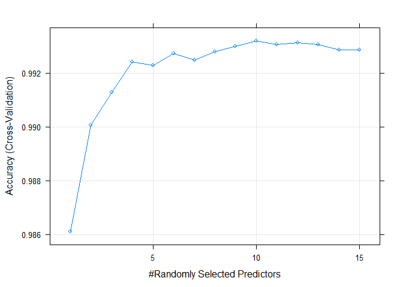
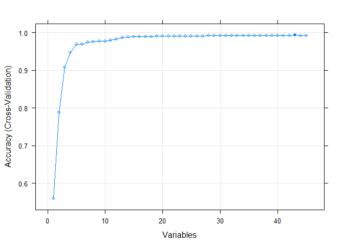

# Practical Machine Learning Assignment
Chan Chee-Foong  
July 15, 2016  


## Executive Summary

The objective of this assignment is to build a prediction model to quantify how well an individual performs doing a weight lifting exercise.

Specifically, we will use data from accelerometers on the belt, forearm, arm, and dumbell of 6 participants. During the data collection exercise, they were asked to perform barbell lifts correctly and incorrectly in 5 different ways.  Each paricipant was asked to do one set of 10 repetitions in five different fashions:  exactly according to the specification (Class A), throwing the elbows to the front (Class B), lifting the dumbbell only halfway (Class C), lowering the dumbbell only halfway (Class D) and throwing the hips to the front (Class E).  Class A corresponds to the specified execution of the exercise, while the other 4 classes correspond to common mistakes. 

More information is available from the website here: <http://groupware.les.inf.puc-rio.br/har> (see the section on the Weight Lifting Exercise Dataset).  Special thanks to them for allowing their data to be used in this assignment.

***
## Configure parallel processing

To improve the performance of machine learning models, caret supports the parallel processing capabilities of the parallel package.


```r
library(parallel)
library(doParallel)
cluster <- makeCluster(detectCores() - 2) # Running on an 8 core computer.  Leaving 2 cores for OS
registerDoParallel(cluster)
```

***
## Data Preprocessing and Feature Selection


The training data for this project are available here: <https://d396qusza40orc.cloudfront.net/predmachlearn/pml-training.csv>.  The test data for the course prediction quiz are available here: <https://d396qusza40orc.cloudfront.net/predmachlearn/pml-testing.csv>


### Summary of the data sets

Data Set | Number of Observations | Number of Variables | Remarks
---------|----------------|-----------------|-----------------------
Training | 19622          | 160 (159 Predictors, 1 Outcome) | Outcome Column Name: classe
Test     | 20             | 160                             | For prediction quiz.  Column not in training set: problem_id

For feature selection, it make sense to focus on predictors available in the testing set as it will be these predictors that will be used by machine learning models for prediction and classification.  Predictors that are available in the testing set but not in the training set or vice versa are useless predictors.  So in this data pre-processsing exercise, we will perform a first level elimination of predictors from the training set by focusing our data analysis on the testing set.


```r
# Extracting the full list of predictors available on the test data set
selectFeature <- data.frame(feature = colnames(training))
selectFeature <- cbind(row = row(selectFeature), selectFeature)
# To begin, classify all predictors as not required
selectFeature$required <- FALSE
```


### Removal of Zero- and Near Zero-Variance Predictors

We seek to identify near zero-variance variables in the testing set.  These near-zero-variance predictors may have undue influence on the models and may need to be identified and eliminated prior to modeling.


```r
# Identifying the Zero Covariates
nearZeroVar <- nearZeroVar(testing, saveMetrics = TRUE)
nearZeroVar <- cbind(name = rownames(nearZeroVar),rownum = 1:nrow(nearZeroVar),nearZeroVar)
rownames(nearZeroVar) <- 1:nrow(nearZeroVar)

# Separate the Zero and Non-Zero Covariates
nonZeroVarFeature <- subset(nearZeroVar, nzv==FALSE)
ZeroVarFeature <- subset(nearZeroVar, nzv==TRUE)

# Show the Zero Covariates
datatable(ZeroVarFeature,
           options = list(pageLength = 5), 
           caption = 'Near-Zero-Variance Predictors')
```

<!--html_preserve--><div id="htmlwidget-9821" style="width:100%;height:auto;" class="datatables html-widget"></div>
<script type="application/json" data-for="htmlwidget-9821">{"x":{"data":[["6","12","13","14","15","16","17","18","19","20","21","22","23","24","25","26","27","28","29","30","31","32","33","34","35","36","50","51","52","53","54","55","56","57","58","59","69","70","71","72","73","74","75","76","77","78","79","80","81","82","83","87","88","89","90","91","92","93","94","95","96","97","98","99","100","101","103","104","105","106","107","108","109","110","111","112","125","126","127","128","129","130","131","132","133","134","135","136","137","138","139","141","142","143","144","145","146","147","148","149","150"],["new_window","kurtosis_roll_belt","kurtosis_picth_belt","kurtosis_yaw_belt","skewness_roll_belt","skewness_roll_belt.1","skewness_yaw_belt","max_roll_belt","max_picth_belt","max_yaw_belt","min_roll_belt","min_pitch_belt","min_yaw_belt","amplitude_roll_belt","amplitude_pitch_belt","amplitude_yaw_belt","var_total_accel_belt","avg_roll_belt","stddev_roll_belt","var_roll_belt","avg_pitch_belt","stddev_pitch_belt","var_pitch_belt","avg_yaw_belt","stddev_yaw_belt","var_yaw_belt","var_accel_arm","avg_roll_arm","stddev_roll_arm","var_roll_arm","avg_pitch_arm","stddev_pitch_arm","var_pitch_arm","avg_yaw_arm","stddev_yaw_arm","var_yaw_arm","kurtosis_roll_arm","kurtosis_picth_arm","kurtosis_yaw_arm","skewness_roll_arm","skewness_pitch_arm","skewness_yaw_arm","max_roll_arm","max_picth_arm","max_yaw_arm","min_roll_arm","min_pitch_arm","min_yaw_arm","amplitude_roll_arm","amplitude_pitch_arm","amplitude_yaw_arm","kurtosis_roll_dumbbell","kurtosis_picth_dumbbell","kurtosis_yaw_dumbbell","skewness_roll_dumbbell","skewness_pitch_dumbbell","skewness_yaw_dumbbell","max_roll_dumbbell","max_picth_dumbbell","max_yaw_dumbbell","min_roll_dumbbell","min_pitch_dumbbell","min_yaw_dumbbell","amplitude_roll_dumbbell","amplitude_pitch_dumbbell","amplitude_yaw_dumbbell","var_accel_dumbbell","avg_roll_dumbbell","stddev_roll_dumbbell","var_roll_dumbbell","avg_pitch_dumbbell","stddev_pitch_dumbbell","var_pitch_dumbbell","avg_yaw_dumbbell","stddev_yaw_dumbbell","var_yaw_dumbbell","kurtosis_roll_forearm","kurtosis_picth_forearm","kurtosis_yaw_forearm","skewness_roll_forearm","skewness_pitch_forearm","skewness_yaw_forearm","max_roll_forearm","max_picth_forearm","max_yaw_forearm","min_roll_forearm","min_pitch_forearm","min_yaw_forearm","amplitude_roll_forearm","amplitude_pitch_forearm","amplitude_yaw_forearm","var_accel_forearm","avg_roll_forearm","stddev_roll_forearm","var_roll_forearm","avg_pitch_forearm","stddev_pitch_forearm","var_pitch_forearm","avg_yaw_forearm","stddev_yaw_forearm","var_yaw_forearm"],[6,12,13,14,15,16,17,18,19,20,21,22,23,24,25,26,27,28,29,30,31,32,33,34,35,36,50,51,52,53,54,55,56,57,58,59,69,70,71,72,73,74,75,76,77,78,79,80,81,82,83,87,88,89,90,91,92,93,94,95,96,97,98,99,100,101,103,104,105,106,107,108,109,110,111,112,125,126,127,128,129,130,131,132,133,134,135,136,137,138,139,141,142,143,144,145,146,147,148,149,150],[0,0,0,0,0,0,0,0,0,0,0,0,0,0,0,0,0,0,0,0,0,0,0,0,0,0,0,0,0,0,0,0,0,0,0,0,0,0,0,0,0,0,0,0,0,0,0,0,0,0,0,0,0,0,0,0,0,0,0,0,0,0,0,0,0,0,0,0,0,0,0,0,0,0,0,0,0,0,0,0,0,0,0,0,0,0,0,0,0,0,0,0,0,0,0,0,0,0,0,0,0],[5,0,0,0,0,0,0,0,0,0,0,0,0,0,0,0,0,0,0,0,0,0,0,0,0,0,0,0,0,0,0,0,0,0,0,0,0,0,0,0,0,0,0,0,0,0,0,0,0,0,0,0,0,0,0,0,0,0,0,0,0,0,0,0,0,0,0,0,0,0,0,0,0,0,0,0,0,0,0,0,0,0,0,0,0,0,0,0,0,0,0,0,0,0,0,0,0,0,0,0,0],[true,true,true,true,true,true,true,true,true,true,true,true,true,true,true,true,true,true,true,true,true,true,true,true,true,true,true,true,true,true,true,true,true,true,true,true,true,true,true,true,true,true,true,true,true,true,true,true,true,true,true,true,true,true,true,true,true,true,true,true,true,true,true,true,true,true,true,true,true,true,true,true,true,true,true,true,true,true,true,true,true,true,true,true,true,true,true,true,true,true,true,true,true,true,true,true,true,true,true,true,true],[true,true,true,true,true,true,true,true,true,true,true,true,true,true,true,true,true,true,true,true,true,true,true,true,true,true,true,true,true,true,true,true,true,true,true,true,true,true,true,true,true,true,true,true,true,true,true,true,true,true,true,true,true,true,true,true,true,true,true,true,true,true,true,true,true,true,true,true,true,true,true,true,true,true,true,true,true,true,true,true,true,true,true,true,true,true,true,true,true,true,true,true,true,true,true,true,true,true,true,true,true]],"container":"<table class=\"display\">\n  <thead>\n    <tr>\n      <th> \u003c/th>\n      <th>name\u003c/th>\n      <th>rownum\u003c/th>\n      <th>freqRatio\u003c/th>\n      <th>percentUnique\u003c/th>\n      <th>zeroVar\u003c/th>\n      <th>nzv\u003c/th>\n    \u003c/tr>\n  \u003c/thead>\n\u003c/table>","options":{"pageLength":5,"columnDefs":[{"className":"dt-right","targets":[2,3,4]},{"orderable":false,"targets":0}],"order":[],"autoWidth":false,"orderClasses":false,"lengthMenu":[5,10,25,50,100]},"callback":null,"caption":"<caption>Near-Zero-Variance Predictors\u003c/caption>","filter":"none"},"evals":[],"jsHooks":[]}</script><!--/html_preserve-->

```r
# Set the Non-Zero Covariates as Required
selectFeature[nonZeroVarFeature$rownum,'required'] <- TRUE
```


### Removal of Irrelavant Predictors

The first seven columns in respective datasets are identification variables recording information about the participants, start/end time of each exercise windows, etc.  Data in these columns are will be elimated from the machine learning model as these are event specific information and not to be used for predictions on the test set.


```r
# First 7 columns of testing data set
colnames(testing[,1:7])
```

```
## [1] "X"                    "user_name"            "raw_timestamp_part_1"
## [4] "raw_timestamp_part_2" "cvtd_timestamp"       "new_window"          
## [7] "num_window"
```

```r
selectFeature[c(1:7),'required'] <- FALSE
```


### Removal of Highly Correlated Predictors

After eliminating predictors that have near zero variance and irrelevant, we have reduced the number of predictors from 159 to 52.  

Many models perform better when highly correlated predictors are removed.  We will study the correlation matrix on the remaining 52 predictors and remove predictors that have correlation > 0.9 using the caret::findCorrelation function.  To find the highest correlation of the predictors, we will use the training data set.  This is because the training data set contains much more observations than the test data set.


```r
# Removing columns from the 2 data sets that are not required up to this point
training2 <- training[,selectFeature[selectFeature$required == TRUE,'row']]
testing2 <- testing[,selectFeature[selectFeature$required == TRUE,'row']]

# Calculate correlation matrix on the training dataset
correlationMatrix <- cor(training2[,1:52])
highlyCorrelated <- findCorrelation(correlationMatrix, cutoff=0.9, 
                                    name = FALSE, exact = ncol(correlationMatrix) < 100)

# Removing the highly correlated predictors on both dataset
trainset <- training2[,-c(highlyCorrelated)]
testset <- testing2[,-c(highlyCorrelated)]
```

***
## Data Slicing

The final training set with 45 predictors and 1 outcome is now ready for machine learning model building.  We will perform a data split on the training data set with a single 80/20% split.  The larger data set to train the model and the smaller data set to validate the final model.


```r
# Data splitting the training set into 2 subset.  
# One for training the model.  One for out of sample model validation.
inTrain <- createDataPartition(y=trainset$classe,p=0.80, list=FALSE)
trainset <- trainset[inTrain,]
validationtest <- trainset[-inTrain,]
```

***
## Cross Validation and Model Training/Tuning

A total of 4 machine learning models will be used to train and develop the prediction algorithm.  As the prediction type is classification (5 classes: A, B, C, D, E), the following models are used:

1) Random Forest (rf)
2) Stochastic Gradient Boosting (gbm)
3) Classification and Regression Trees - CART (rpart)
4) Recursive Feature Elimination (rfe)

While we use 5-fold cross validation to generate sub-training/test sets for training rf, gbm and rfe models, 10 repeated 10-fold cross validation will be used to train rpart model.  These cross validation settings are selected based on the shorter time required to train each model without compromising model accuracy.  The setting is passed in as parameters via the trainControl or rfeControl functions depending on models.

### 1. using Random Forest (rf)

Tuning of the random forest model is done by running mtry (number of variables randomly sampled as candidates at each split) from 1 to 15 using tuneGrid.  Number of trees to grow is fixed at a constant of 500.


```r
### Random Forest
set.seed(3567)

## 5-fold CV repeated 5 times
train_control <- trainControl(method = "cv", number = 5, search='grid')
metric <- "Accuracy"

## Tune with 15 mtry
tunegrid <- expand.grid(.mtry=c(1:15))

rfmodel <- train(classe~., data=trainset, method="rf", 
                 metric=metric, tuneGrid=tunegrid, trControl=train_control, ntree=500)

# Model summary
print(rfmodel)
```

```
## Random Forest 
## 
## 15699 samples
##    45 predictor
##     5 classes: 'A', 'B', 'C', 'D', 'E' 
## 
## No pre-processing
## Resampling: Cross-Validated (5 fold) 
## Summary of sample sizes: 12560, 12560, 12560, 12558, 12558 
## Resampling results across tuning parameters:
## 
##   mtry  Accuracy   Kappa    
##    1    0.9861132  0.9824294
##    2    0.9900627  0.9874277
##    3    0.9912731  0.9889595
##    4    0.9924197  0.9904106
##    5    0.9922923  0.9902495
##    6    0.9927382  0.9908137
##    7    0.9924834  0.9904912
##    8    0.9928019  0.9908940
##    9    0.9929930  0.9911357
##   10    0.9931840  0.9913774
##   11    0.9930568  0.9912166
##   12    0.9931205  0.9912971
##   13    0.9930567  0.9912164
##   14    0.9928656  0.9909746
##   15    0.9928655  0.9909745
## 
## Accuracy was used to select the optimal model using  the largest value.
## The final value used for the model was mtry = 10.
```

As seen from the training results above, mtry = 10 gives the best accuracy of 99.32%.  Below shows the chart plotting mtry against accuracy.  mtry = 10 shows the highest point on the chart.


```r
# Plotting the model
plot(rfmodel)
```



### 2. using Stochastic Gradient Boosting (gbm)

Tuning of the gbm model is done by running interaction.depth of 1, 5 and 9 and n.trees of 100, 200 and 300.  These are configure in a grid and passed into tuneGrid.  Shrinkage and n.minobsinnode are set to 0.1 and 10 respectively.


```r
### Stochastic Gradient Boosting
set.seed(3567)

## 5-fold CV repeated 5 times
train_control <- trainControl(method = "cv", number = 5)

## Tune with interaction depth of 1, 5, 9 and number of trees of 100, 200, 300
gbmGrid <- expand.grid(interaction.depth = c(1, 5, 9), n.trees = c(100,200,300), 
                       shrinkage = 0.1, n.minobsinnode = 10)

# Train the model
gbmmodel <- train(classe~., data=trainset, method="gbm", trControl=train_control, 
                  verbose = FALSE, tuneGrid = gbmGrid)

# Model summary
print(gbmmodel)
```

```
## Stochastic Gradient Boosting 
## 
## 15699 samples
##    45 predictor
##     5 classes: 'A', 'B', 'C', 'D', 'E' 
## 
## No pre-processing
## Resampling: Cross-Validated (5 fold) 
## Summary of sample sizes: 12560, 12560, 12560, 12558, 12558 
## Resampling results across tuning parameters:
## 
##   interaction.depth  n.trees  Accuracy   Kappa    
##   1                  100      0.8133639  0.7637983
##   1                  200      0.8652141  0.8294009
##   1                  300      0.8887830  0.8592075
##   5                  100      0.9675139  0.9588985
##   5                  200      0.9854760  0.9816271
##   5                  300      0.9898078  0.9871078
##   9                  100      0.9845843  0.9804993
##   9                  200      0.9910817  0.9887188
##   9                  300      0.9928654  0.9909749
## 
## Tuning parameter 'shrinkage' was held constant at a value of 0.1
## 
## Tuning parameter 'n.minobsinnode' was held constant at a value of 10
## Accuracy was used to select the optimal model using  the largest value.
## The final values used for the model were n.trees = 300,
##  interaction.depth = 9, shrinkage = 0.1 and n.minobsinnode = 10.
```

From the training results shown above, the model when interactive.depth = 9 and n.trees = 300 gives the best accuracy at 99.29%.  

### 3. using Classification and Regression Trees - CART (rpart)

Tuning of the rpart model is done by running cp from 0 to 0.1 in steps of 0.005.  These are configured in a grid and passed into tuneGrid.


```r
# Classification and Regression Trees (CART)
set.seed(3567)
 
## 10-fold CV repeated 10 times
train_control <- trainControl(method="repeatedcv", number = 10, repeats = 10)

rpGrid <- expand.grid(cp = seq(0,0.1, by=0.005))

# Train the model
rpmodel <- train(classe~., data=trainset, method="rpart", trControl=train_control, 
                 tuneLength=20, tuneGrid = rpGrid)

# Model summary
print(rpmodel)
```

```
## CART 
## 
## 15699 samples
##    45 predictor
##     5 classes: 'A', 'B', 'C', 'D', 'E' 
## 
## No pre-processing
## Resampling: Cross-Validated (10 fold, repeated 10 times) 
## Summary of sample sizes: 14129, 14129, 14129, 14130, 14130, 14129, ... 
## Resampling results across tuning parameters:
## 
##   cp     Accuracy   Kappa    
##   0.000  0.9275942  0.9084068
##   0.005  0.7819025  0.7241442
##   0.010  0.7086368  0.6295477
##   0.015  0.6304135  0.5303526
##   0.020  0.5738911  0.4592465
##   0.025  0.5201019  0.3744675
##   0.030  0.5201019  0.3744675
##   0.035  0.4738383  0.3122920
##   0.040  0.4733860  0.3116705
##   0.045  0.4733860  0.3116705
##   0.050  0.4733860  0.3116705
##   0.055  0.4733860  0.3116705
##   0.060  0.4733860  0.3116705
##   0.065  0.4733860  0.3116705
##   0.070  0.2843493  0.0000000
##   0.075  0.2843493  0.0000000
##   0.080  0.2843493  0.0000000
##   0.085  0.2843493  0.0000000
##   0.090  0.2843493  0.0000000
##   0.095  0.2843493  0.0000000
##   0.100  0.2843493  0.0000000
## 
## Accuracy was used to select the optimal model using  the largest value.
## The final value used for the model was cp = 0.
```

The training results show that for the rpart model, the best accuracy of 92.76% comes from the model when cp = 0.

### 4. using Recursive Feature Elimination (rfe)

Using Recursive Feature Elimination (RFE) method provided by caret R package, we tune the model by selecting the best feature (predictor) auotmatically.  A random forest algorithm will be used on each iteration to evaluate the model.  


```r
set.seed(3567)

# RFE Model Training and Tuning
# Define the control using a random forest selection function.  Using 5-fold Cross Validation
control <- rfeControl(functions=rfFuncs, method="cv", number=5)

# Train the model
rfemodel <- rfe(trainset[,1:45], trainset[,46], sizes=c(1:45), rfeControl=control)

# Model summary
print(rfemodel)
```

```
## 
## Recursive feature selection
## 
## Outer resampling method: Cross-Validated (5 fold) 
## 
## Resampling performance over subset size:
## 
##  Variables Accuracy  Kappa AccuracySD   KappaSD Selected
##          1   0.5604 0.4417  0.0107512 0.0138271         
##          2   0.7880 0.7319  0.0075467 0.0095928         
##          3   0.9078 0.8833  0.0057903 0.0073564         
##          4   0.9473 0.9333  0.0005610 0.0006991         
##          5   0.9697 0.9617  0.0038816 0.0048980         
##          6   0.9697 0.9617  0.0041761 0.0052752         
##          7   0.9745 0.9677  0.0031541 0.0039885         
##          8   0.9760 0.9696  0.0030308 0.0038341         
##          9   0.9778 0.9720  0.0042310 0.0053506         
##         10   0.9770 0.9709  0.0053888 0.0068141         
##         11   0.9807 0.9756  0.0040981 0.0051832         
##         12   0.9836 0.9793  0.0022597 0.0028566         
##         13   0.9864 0.9828  0.0033770 0.0042707         
##         14   0.9881 0.9849  0.0005785 0.0007316         
##         15   0.9893 0.9865  0.0022845 0.0028905         
##         16   0.9899 0.9873  0.0013271 0.0016790         
##         17   0.9900 0.9873  0.0021696 0.0027448         
##         18   0.9903 0.9878  0.0021692 0.0027443         
##         19   0.9908 0.9884  0.0018376 0.0023248         
##         20   0.9909 0.9885  0.0021927 0.0027740         
##         21   0.9913 0.9890  0.0025464 0.0032217         
##         22   0.9907 0.9882  0.0022926 0.0029008         
##         23   0.9913 0.9890  0.0031984 0.0040470         
##         24   0.9910 0.9886  0.0032612 0.0041267         
##         25   0.9915 0.9892  0.0024527 0.0031034         
##         26   0.9915 0.9892  0.0024423 0.0030905         
##         27   0.9918 0.9896  0.0024528 0.0031033         
##         28   0.9922 0.9901  0.0021338 0.0027001         
##         29   0.9921 0.9900  0.0020824 0.0026351         
##         30   0.9920 0.9898  0.0015848 0.0020055         
##         31   0.9918 0.9897  0.0014369 0.0018181         
##         32   0.9921 0.9900  0.0017079 0.0021610         
##         33   0.9925 0.9905  0.0019467 0.0024631         
##         34   0.9927 0.9908  0.0019568 0.0024759         
##         35   0.9928 0.9909  0.0020482 0.0025915         
##         36   0.9928 0.9909  0.0019850 0.0025117         
##         37   0.9925 0.9906  0.0014885 0.0018831         
##         38   0.9927 0.9908  0.0018779 0.0023764         
##         39   0.9931 0.9912  0.0013789 0.0017448         
##         40   0.9927 0.9907  0.0010821 0.0013695         
##         41   0.9927 0.9907  0.0010335 0.0013078         
##         42   0.9931 0.9912  0.0009934 0.0012572         
##         43   0.9932 0.9915  0.0011365 0.0014379        *
##         44   0.9924 0.9904  0.0012636 0.0015992         
##         45   0.9925 0.9906  0.0009462 0.0011972         
## 
## The top 5 variables (out of 43):
##    yaw_belt, magnet_dumbbell_z, pitch_belt, magnet_dumbbell_y, pitch_forearm
```

Note that the alogrithm is configured to explore all possible subsets of the 45 predictors.  By plotting the results, we show the accuracy of the different predictors subset size.  With 43 predictors, the accuracy is highest at 99.32%.  Hence, we should expect the out of sample error to be small, the model prediction should be highly accurate.


```r
# Plotting the results
plot(rfemodel, type=c("g", "o"))
```



***
## Model Validation

We use the validation data set as an out of sample set to validate all the 4 models and assess their accuracy.  The confusion matrices confirm that prediction accuracy of the models.  


```r
# Predicting the validation data set
rfValidation <- predict(rfmodel,validationtest)  ## Random Forest Validation
gbmValidation <- predict(gbmmodel,validationtest)  ## Stochastic Gradient Boosting Validation
rpValidation <- predict(rpmodel,validationtest)  ## CART Validation
rfeValidation <- predict(rfemodel$fit,validationtest)  ## Recursive Feature Elimination Validation

# Output the confusion matrix of the prediction and the validation outcome
confusionMatrix(validationtest$classe, rfValidation)$table  ## Random Forest Confusion Matrix
```

```
##           Reference
## Prediction   A   B   C   D   E
##          A 877   0   0   0   0
##          B   0 622   0   0   0
##          C   0   0 537   0   0
##          D   0   0   0 525   0
##          E   0   0   0   0 572
```

```r
confusionMatrix(validationtest$classe, gbmValidation)$table  ## Stochastic Gradient Boosting Confusion Matrix
```

```
##           Reference
## Prediction   A   B   C   D   E
##          A 877   0   0   0   0
##          B   0 622   0   0   0
##          C   0   0 537   0   0
##          D   0   0   0 525   0
##          E   0   0   0   0 572
```

```r
confusionMatrix(validationtest$classe, rpValidation)$table  ## CART Confusion Matrix
```

```
##           Reference
## Prediction   A   B   C   D   E
##          A 861   7   4   2   3
##          B  16 584  14   2   6
##          C   2  11 520   1   3
##          D   1   4   9 502   9
##          E   6  13   6  11 536
```

```r
confusionMatrix(validationtest$classe, rfeValidation)$table  ## Recursive Feature Elimination Confusion Matrix
```

```
##           Reference
## Prediction   A   B   C   D   E
##          A 877   0   0   0   0
##          B   0 622   0   0   0
##          C   0   0 537   0   0
##          D   0   0   0 525   0
##          E   0   0   0   0 572
```

```r
percent <- function(x, digits = 2, format = "f", ...) {
  paste0(formatC(100 * x, format = format, digits = digits, ...), "%")
}

# Accuracy of the 4 models on the validation data set
accuracy <- data.frame(cbind(RF = percent(confusionMatrix(validationtest$classe, rfValidation)$overall[1]),
                  GBM = percent(confusionMatrix(validationtest$classe, gbmValidation)$overall[1]),
                  CART = percent(confusionMatrix(validationtest$classe, rpValidation)$overall[1]),
                  RFE = percent(confusionMatrix(validationtest$classe, rfeValidation)$overall[1])), 
                  row.names = 'Accuracy')

accuracy
```

```
##               RF     GBM   CART     RFE
## Accuracy 100.00% 100.00% 95.85% 100.00%
```

We can see all the models except CART give 100% accuracy to the out of the sample validation data set.  CART gives an accuracy of 95.85%.  Which also means that from a test set with 20 observations, there is a chance that 1 observations may be predicted incorrectly.


***
## Model Prediction

Using all the 4 models to predict the 20 different test cases in this assignment, the results can be seen below.  We observed that the predictions are consistent across all model except for prediction 6 by the CART model.  CART model predicted 'C' while the rest predicted 'E'.  Nevertheless, we will proceed to submission our prediction generated from the RF model as the model summary shows highest accuracy level.


```r
# Predicting the test data set
prediction <- data.frame(RF = predict(rfmodel,testset),   # Random Forest Prediction
                    GBM = predict(gbmmodel,testset),      # Stochastic Gradient Boosting Prediction
                    CART = predict(rpmodel,testset),      # CART Prediction
                    RFE = predict(rfemodel$fit,testset))  # Recursive Feature Elimination Prediction

prediction <- data.frame(t(prediction))
colnames(prediction) <- 1:20

# Prediction results by the 4 models
prediction
```

```
##      1 2 3 4 5 6 7 8 9 10 11 12 13 14 15 16 17 18 19 20
## RF   B A B A A E D B A  A  B  C  B  A  E  E  A  B  B  B
## GBM  B A B A A E D B A  A  B  C  B  A  E  E  A  B  B  B
## CART B A B A A C D B A  A  B  C  B  A  E  E  A  B  B  B
## RFE  B A B A A E D B A  A  B  C  B  A  E  E  A  B  B  B
```

```r
# The results to be submitted in the project quiz
predict(rfmodel,testset)
```

```
##  [1] B A B A A E D B A A B C B A E E A B B B
## Levels: A B C D E
```

Submission of the prediction results to the Course Project Prediction Quiz has been given a perfect score of 20/20.

***
## Conclusion
With the right selection of features, models, parameters and tuning techniques, it is possible to train any models with high accuracy.  Good understanding of the training and test data set will pave the way to a more effective and error free model training exercise, enhancing prediciton accuracy in the shortest possible time with the least computing power.


